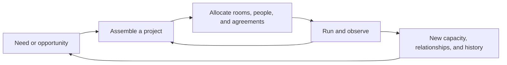

# Chasidica — complete design, version 1

Decision date: 2026-09-06. The user delegated the remaining design decisions. This document and the specifications it links are the selected direction, superseding the earlier exploratory options.

This is a complete product and gameplay blueprint, not a claim that the game has been built or that its fun has been demonstrated. Numbers are starting balance values or explicit production targets. Change them when evidence warrants a revision; record the reason.

## The game

Chasidica is a single-player, pausable strategy game about building an enduring Hasidic community through clever arrangements of people, places, and commitments. It begins in a rented shtiebel in a fictional New York neighborhood and ends with a comically ambitious worldwide network.

The central pleasure is discovering a plan that makes several things work together: one building serving different purposes, an overlooked person making a new project possible, a partnership solving a constraint, or a local invention becoming a tradition elsewhere.

The player guides the court across generations. The rebbe and family are important characters. The player directs the court's institutions and negotiates with everyone else; households, businesses, partners, and rival courts retain their own agency.

## Product decisions

| Area | Selected direction |
| --- | --- |
| Primary audience | Players who enjoy thoughtful management, discovering combinations, personal stories, and building a place they care about. |
| Main view | Warm, detailed 3D miniature neighborhood; orthographic camera, four rotation positions, zoom, and selected-room cutaways. |
| Core activity | Assemble and revise projects using spaces, schedules, people, and agreements. |
| Secondary activity | Negotiate support and manage commitments that change future options. |
| Main pleasures | Discovery, strategic mastery, creative expression, attachment, and affectionate comedy. |
| Campaign | Begins in 2028; usually spans several generations. Target first completion: 20–30 hours. |
| Clock | Weekly simulation; pause and 1x/4x/12x speeds. Planning panels pause by default. |
| Time baseline | One simulation week per four real seconds at 1x, excluding pauses; this is a tuning value. |
| Platforms | Windows and Linux desktop, keyboard and mouse. |
| Technology | Godot 4.7.2, typed GDScript, Compatibility renderer, modular Blender assets exported as GLB. |
| Business model | Premium offline game, target US list price $24.99, free opening-chapter demo. These are product decisions, not published offers. |
| Development model | Public planning/development repository; original game work retains its rights. Third-party material keeps its own license and attribution. |
| Runtime content | Authored and procedural rules with reproducible seeds; no runtime generative-AI service or account requirement. |

## What the player actually does

An institution starts with an intention: teach, welcome, provide, connect, or establish a place. The player turns that intention into an executable project.

1. Inspect a need or opportunity in the neighborhood.
2. Pick a target, such as 20 additional school places or a gathering for visiting families.
3. Assemble a plan: venue, time band, lead, staff, equipment, supplies, and any partner agreements.
4. Compare immediate cost, weekly operation, conflicts, capacity, and available space afterward.
5. Commit resources and let the plan operate.
6. Respond to developments, enjoy the result, and reuse what the community has learned or acquired.

Most assignments persist until changed. Free inspection, reversible drafting, and clear forecasts make experimentation easy. Committing a project has real consequences in money, staff availability, occupied spaces, and promises.

## The core mechanic: useful combinations under constraints

A property contains a few functional zones, such as a hall, upstairs room, storefront, kitchen, and yard. Each zone has a hard capacity, equipment, access, and separate daytime and evening availability. A school and an evening gathering can share a hall if equipment, setup, staffing, and existing commitments allow it.

People provide specific capabilities and exceptions to ordinary requirements. A teacher skilled at portable classrooms can use a properly equipped shared hall. An experienced host can organize household hospitality. A practical administrator can coordinate an additional renovation crew. Capabilities create new arrangements; they never override hard occupancy limits or existing contracts.

Relationships supply additional options. A partner might lend a room in exchange for tutoring, reserve a bus in exchange for a return visit, or fund a specified program. Such agreements occupy real capacity or budget later.

The interesting tradeoff is frequently present efficiency versus future flexibility. Using every room well is attractive until a new opportunity needs the room or person already committed elsewhere. Leasing more space costs money but preserves options. Cooperation can be cheaper while creating obligations and useful relationships.

The initial rules fixture demonstrates that room sharing, leasing, and borrowing can each become the cheapest feasible plan under different stated conditions. It cannot prove that choosing between them is enjoyable. See [the mechanics specification and experiment](docs/mechanics.md).

## One coherent set of systems

| System | Why it belongs in the game |
| --- | --- |
| Properties and schedules | Supply the spatial and temporal constraints behind the core puzzle. |
| People and households | Supply capabilities, preferences, demand, continuity, and independent responses. |
| Institutions and businesses | Turn projects into persistent useful services and livelihoods. |
| Finance and commitments | Make opportunity cost visible and let the player choose a manageable level of risk. |
| Relationships and rival courts | Provide alternative solutions, competition, reciprocal help, and disagreement. |
| Calendar and occasions | Give projects occasions to serve and give the player anticipated payoffs. |
| Succession and family history | Change capabilities and relationships while preserving the consequences of previous play. |
| Branches and transport | Extend the project puzzle into cooperation between places. |
| Memory and story direction | Connect unscripted outcomes with authored occasions and later callbacks. |

The initial release does not include combat, direct control of individual daily routines, multiplayer, unrestricted architectural modeling, or a simulated global economy. These boundaries keep attention on the selected game.

## The campaign, beginning to end

Progression depends on demonstrated capabilities and accomplishments, not fixed population thresholds or dates. Household counts are context, not a birth-rate victory target.

| Chapter | Ambition | The new decision it introduces |
| --- | --- | --- |
| 1. A place of our own | Stabilize the rented court and obtain a permanent home. | Share, lease, borrow, or buy while keeping existing activities working. |
| 2. A neighborhood that works | Establish reliable learning, livelihoods, housing access, and communal life. | Combine institutions and specialize without leaving needs unattended. |
| 3. Beyond the block | Found a satellite and operate a reliable connection. | Decide what to duplicate, what to share, and whom to trust locally. |
| 4. The next generation | Handle the first leadership transition and turn a set of branches into a durable dynasty. | Balance competence, trust, continuity, and a successor's different strengths. |
| 5. A worldwide court | Establish charter partnerships across the globe. | Negotiate reciprocal commitments among communities with different resources. |
| 6. The Great Gathering | Coordinate the first worldwide convocation and complete the comic domination goal. | Bring the entire network together while ordinary communities continue functioning. |

Succession can happen before or after other chapters according to the actual characters' lives. It is a system, not a scripted date gate.

The finale requires 12 charter cities covering all six inhabited continents, three independent rival courts joining the compact, eight quarters of operational stability, and a successful distributed gathering. Preparation lasts 26 simulation weeks. The player coordinates travel, hosting, scheduling, supplies, and trust through the existing project system.

The victory presentation announces **World domination achieved: everything now has a committee. Yours.** It revisits the original building, first families, and chosen melody. A world charter represents voluntary participation and institutional reach. It does not transfer ownership of countries or people.

After victory, continue freely. A slow campaign may continue past 2128; there is no arbitrary century deadline. Full calendar support is planned through 2178, after which the game remains in a final-year sandbox without further aging.

See [campaign, people, and story](docs/campaign.md) for chapter conditions, the opening session, characters, endings, and replay structure.

## Growth without multiplying chores

The player directly manages at most three campuses simultaneously. Other branches receive a steward, budget envelope, reserves policy, priorities, and limits on which commitments they may make. A player can switch a campus into direct management at any time by delegating another.

An autonomous branch uses the same capacities and financial rules. Its steward reports significant opportunities, unmet constraints, and exceptions. Recurring maintenance and already-approved activities continue without repeated clicks. The player can always inspect an explanation of a decision.

At world scale, local capabilities become service packages with provenance: the actual schools, kitchens, hosts, staff, and routes that make the package possible. Detailed neighborhoods remain visitable. Distant routine population is aggregated while named people and remembered places keep their identity.

## Joy is part of the rules

Useful combinations also enable generosity, spontaneous cooperation, new activities, and memorable occasions. Events react to actual people, spaces, agreements, and campaign history.

A resident can contribute independently. A successful gathering can simply go well. The player can watch school dismissal, a wedding, a tish, a shop opening, or a reunion without answering another question. Looking closely at an occasion pauses the strategic clock by default.

The director spaces major decisions and setbacks, avoids repeated event templates, and creates opportunities from existing state. The game remembers a limited set of significant facts so that a former pupil's return or a familiar melody in a distant branch is grounded in the campaign.

The escalation should also be funny in play: an administrator who once organized two vans is suddenly responsible for arrivals on six continents. The old neighborhood committee still has opinions about where everyone should sit. Their resources and agreements remain real even as their responsibilities become ridiculous.

## Art, music, and interface

The art direction is a crafted miniature New York: warm brick, recognizable institutions, expressive silhouettes, visible interiors, changing light, and small social animations. The camera rewards both surveying a block and looking closely at an occasion.

The musical identity combines original niggun-inspired themes, communal singing, and modern Hasidic arrangements. Three court motifs each receive intimate, festive, and grand treatments. Three additional cues cover travel, reflection, and everyday atmosphere. Instruments and voices have separate stems so an occasion can grow audibly and respect its calendar treatment.

The neighborhood occupies most of the screen. A selected-person or selected-place panel opens on the right. The project planner shows requirements and allocation conflicts; the timeline shows upcoming commitments; the ledger explains changes. Alerts are limited and grouped.

The English interface includes a searchable glossary, optional Hebrew/Yiddish terms, scalable text, keyboard operation, adjustable audio categories, reduced motion, and visual equivalents for important audio cues. See [presentation and content](docs/presentation.md).

## Difficulty and setbacks

Standard is thoughtful and forgiving, with forecasts, warnings, unrestricted saving, and pausing. Gentle supplies larger reserves and earlier warnings. Demanding tightens resource and relationship margins; it does not require faster clicking. A creative sandbox provides adjustable funds and time for players seeking expression.

Missed goals usually cost an opportunity, a relationship, or a temporary loss of capacity. Financial trouble opens restructuring, selling a property, or joining a partner court. A split can create a rival branch while the player retains a meaningful community. Death alone never ends the campaign.

The terminal failure condition is no operating institution and no affiliated households for eight consecutive weeks, after recovery offers. The player receives a legacy summary and can load a save or restart the seed. Deliberately retiring also produces a legacy ending.

## Delivery decision

Build and evaluate the smallest repeatable version of the project puzzle first. Then add one expressive neighborhood, a repeatable first chapter, succession and delegation, regional expansion, and finally the world campaign.

Graphics and sound receive an early representative scene, but asset production expands after the relevant mechanics demonstrate promise. Production gates, content quantities, architecture, performance targets, saving, testing, and launch scope are defined in [the production plan](docs/production.md).

The design decisions are made. The next deliverable is the bounded mechanics prototype specified in the plan. This planning pass does not install an engine, hire people, buy assets, publish a storefront, or implement the production game.
