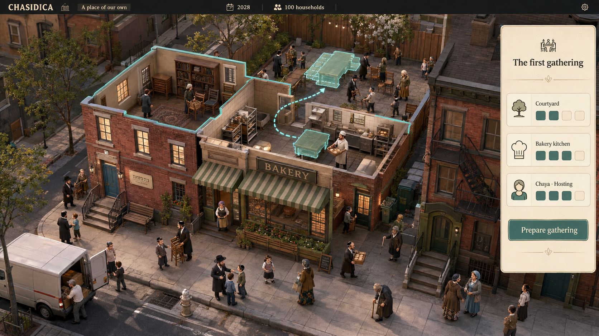
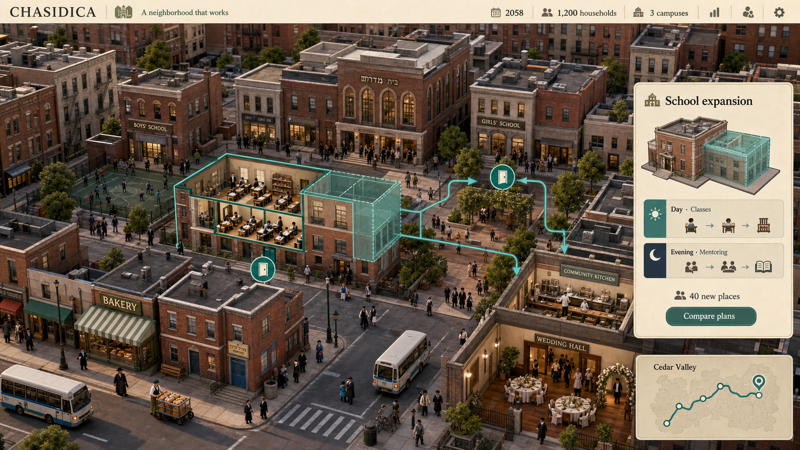
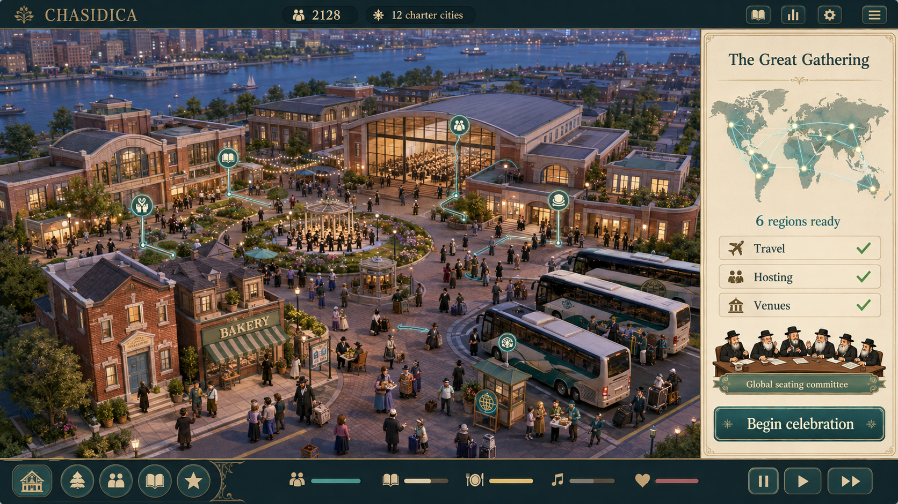

# Chasidica — early, middle, and late game

Three AI-generated visual concepts, created with the built-in image-generation tool and the imagegen skill. These are **not screenshots of a running game**. They explore the selected miniature-city direction, interface, and sense of growth; figures, labels, and layouts are illustrative, not locked implementation details.

The recurring visual anchors are the old red-brick shtiebel with its blue door, the neighboring bakery's sage-green awning, and a warm brick/cream/teal palette. The scope grows from a few useful rooms to connected institutions and then a worldwide gathering, while the original place remains meaningful.

## Early game — a place of our own

A cramped rented shtiebel, a bakery kitchen, a courtyard, and a first gathering made possible by shared space and an organizer.

## Middle game — a neighborhood that works

An established neighborhood of schools, shops, gathering spaces, and connected campuses. The player compares a school expansion while ordinary communal life continues.

## Late game — the Great Gathering

A welcoming central campus prepares for visitors from six continents. The original shtiebel and bakery survive in the foreground; a world-panel connects the local work with the wider voluntary network.

## Prompts, provenance, and reuse

The [exact prompt set](prompts.md) records the shared art direction and stage-specific requests. Each image was a separate new generation with no external reference image. No production engine was used. Generated pixels and text still require human art/cultural review before any production use.

Review notes: the landmarks share recognizable motifs rather than identical geometry or positions. Small Hebrew signs are not approved production text. Unlabeled gauges, icons, and routes are illustrative and do not add currencies or requirements to the game design. Lighting detail and crowd density are visual ambitions, not measured performance targets.

See [manifest.json](manifest.json) for final file hashes, dimensions, and generation provenance. Image and prompt reuse follows [the project's CC BY-SA 4.0 terms](../../LICENSING.md), to the extent of rights the project can grant. Credit Chasidica contributors and identify the images as AI-generated concepts rather than screenshots.
